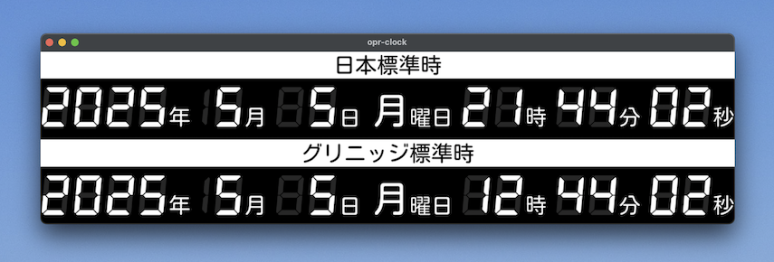

# opr-clock
A digital clock inspired by the clock in the JMA's operation room



## Overview

`opr-clock` is a dual-timezone digital clock designed for a 1920x480 screen, displaying Japan Standard Time (JST) and Greenwich Mean Time (GMT) in a vertically stacked layout. It uses DSEG7Classic and Kosugi Maru fonts to reproduce a clear, segmented look inspired by the Japan Meteorological Agency's operation room.

- ⏲️ Displays year, month, day, weekday, hour, minute, and second.
- 🌗 Shows both JST and GMT simultaneously.
- 📺 Outputs directly to the Raspberry Pi framebuffer (`/dev/fb0`).
- 🖥️ Preview mode available using Tkinter.

## Required Display
This project is designed for use with a vertically oriented display with a resolution of 1920×480.

📦 A compatible 1920×480 monitor must be purchased separately.  
These displays are often available from marketplaces like AliExpress or other online vendors.

## Recommended Environment
For running opr-clock on Raspberry Pi, I recommend the following setup:

Raspberry Pi OS (Legacy) Lite (64-bit)  
Based on Debian 11 (Bullseye)

👉 https://www.raspberrypi.com/software/operating-systems/#raspberry-pi-os-legacy-64-bit

## Installation (Raspberry Pi)

### Confirm Framebuffer Resolution

Before continuing, check that your display is recognized with the correct framebuffer settings:

```sh
$ fbset
```
Expected output:
```
mode "480x1920"
    geometry 480 1920 480 1920 16
    timings 0 0 0 0 0 0 0
    accel true
    rgba 5/11,6/5,5/0,0/0
endmode
```
If you see this, the framebuffer is correctly configured for 480×1920 vertical display.

### Framebuffer Setup

To enable vertical 480×1920 display output and hide boot messages on Raspberry Pi, edit the boot configuration as follows:

1.  Open the cmdline.txt file:

```sh
$ sudo nano /boot/cmdline.txt
```

2. Append the following options after rootwait, on the same line:

```
logo.nologo quiet vt.global_cursor_default=0 video=HDMI-A-1:480x1920M@60,rotate=90
```
⚠️ Make sure everything stays on a single line. Do not insert line breaks.

Example (full `cmdline.txt`):
```
console=serial0,115200 console=tty1 root=PARTUUID=025013d0-02 rootfstype=ext4 fsck.repair=yes rootwait logo.nologo quiet vt.global_cursor_default=0 video=HDMI-A-1:480x1920M@60,rotate=90 cfg80211.ieee80211_regdom=JP
```

This ensures that the display is rotated correctly, the resolution is set to 480x1920, the boot logo is hidden, and the cursor does not appear.

### NTP Setup

```sh
$ sudo nano /etc/systemd/timesyncd.conf
```

```
[Time]
NTP=ntp.nict.jp
```

```sh
$ sudo timedatectl set-ntp true
```

### Install and Run

```sh
$ git clone https://github.com/9SQ/opr-clock.git
$ cd opr-clock
$ mkdir fonts
$ cd fonts
$ wget https://github.com/googlefonts/kosugi-maru/raw/refs/heads/main/fonts/ttf/KosugiMaru-Regular.ttf
$ wget https://github.com/keshikan/DSEG/releases/download/v0.46/fonts-DSEG_v046.zip
$ unzip fonts-DSEG_v046.zip
$ cp fonts-DSEG_v046/DSEG7-Classic/DSEG7Classic-BoldItalic.ttf ./
$ cd ../
$ python3 main.py
```
To exit, press `Ctrl+C`

### systemd Setup
To run the clock as a systemd service on Raspberry Pi:

```sh
$ sudo cp opr-clock.service /etc/systemd/system/
$ sudo systemctl enable opr-clock
$ sudo systemctl start opr-clock
```
⚠️ The default username on Raspberry Pi OS is `pi`.  
If you're using a different username, be sure to replace `pi` with your actual username in the `opr-clock.service` file.
```
ExecStart=/usr/bin/python3 /home/pi/opr-clock/main.py
WorkingDirectory=/home/pi/opr-clock
User=pi
```

## Preview mode (Windows/macOS/Linux)

Download fonts, install Python3 with Tkinter, PIL(Pillow) and run:

```sh
$ python3 main.py --preview
```

## Folder Structure

```
opr-clock/
├── fonts/
│   ├── DSEG7Classic-BoldItalic.ttf <- download it your self
│   └── KosugiMaru-Regular.ttf <- download it your self
├── LICENSE
├── main.py
├── opr-clock.service
├── preview.png
└── README.md
```